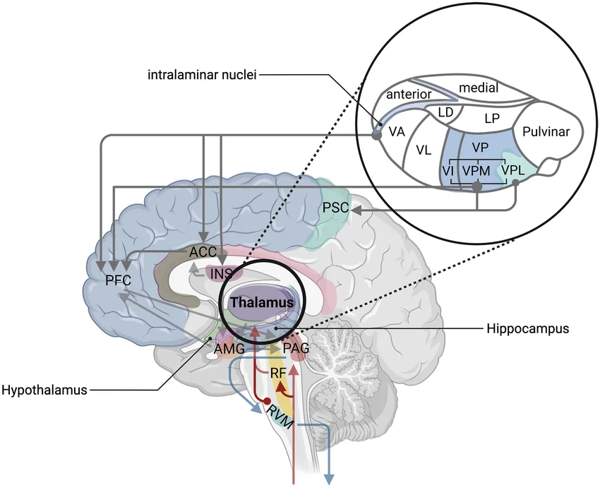

# BioMind-Thalamus

**Biologically faithful thalamic relay and gating circuit in pure Python/NumPy**

---

## Overview

BioMind-Thalamus is a spiking neural network simulation of the thalamic relay and gating system, built from biological first principles. It models thalamocortical relay populations, reticular nucleus (TRN) inhibitory gating, basal ganglia input integration, and corticothalamic feedback — all validated against experimental electrophysiology data.

This is the second component in the BioMind architecture, receiving disinhibitory signals from [BioMind-BG](https://github.com/Rekhii/Biomind) (Component 1) and routing them toward cortical targets.

## Architecture



### Populations (6 total)

| Population | Type | Role |
|---|---|---|
| VL (Ventrolateral) | Relay | Motor command relay |
| VA (Ventroanterior) | Relay | Motor planning relay |
| MD (Mediodorsal) | Relay | Cognitive/executive relay |
| IL (Intralaminar) | Relay | Arousal and salience broadcast |
| TRN-motor | Inhibitory | Gating of VL/VA relay |
| TRN-cognitive | Inhibitory | Gating of MD/IL relay |

### Connectivity

- **18 synaptic pathways** including relay→TRN, TRN→relay, corticothalamic feedback, and cross-modal TRN inhibition
- **GPi/SNr basal ganglia inputs** providing tonic inhibition released by BG action selection
- **Corticothalamic feedback** modulating relay gain

### Neuron Models

- **LIF (Leaky Integrate-and-Fire)** neurons for TRN populations
- **RelayNeuron** class extending LIF with **T-type calcium channels** (de-inactivation gating variable `h`, burst firing capability)

## Validation Experiments

| # | Experiment | What it validates |
|---|---|---|
| 1 | Baseline firing rates | All populations fire within biological ranges |
| 2 | BG disinhibition gating | GPi release selectively activates target relay nuclei |
| 3 | Corticothalamic gain modulation | Feedback enhances relay response without runaway excitation |
| 4 | Sleep spindles | TRN-relay loop generates 7–14 Hz oscillations with T-channel burst firing |
| 5 | Selective attention routing | Competing inputs are resolved by differential TRN gating |

## File Structure

```
├── params.py          # Biological parameters (membrane, synaptic, channel constants)
├── neurons.py         # LIF and RelayNeuron classes with T-type calcium channels
├── populations.py     # 6 thalamic populations (4 relay + 2 TRN)
├── connections.py     # 18 synaptic pathways
├── timestep.py        # Simulation engine (1ms resolution)
├── experiments.py     # 5 validation experiments
├── run.py             # Entry point
└── README.md
```

## Requirements

- Python 3.8+
- NumPy

No external neuroscience frameworks. Pure Python/NumPy for full visibility into every biological mechanism.

## Usage

```bash
python run.py
```

Runs all 5 validation experiments sequentially with console output showing firing rates, gating ratios, and spectral analysis.

## Key Design Decisions

- **T-type calcium channels** use the correct current direction: `I_T = G_T * m² * h * (E_Ca - V)` with biologically calibrated conductance (G_T = 0.05 nS)
- **TRN neurons** receive baseline drive current to maintain tonic firing, matching in vivo recordings
- **Sleep spindle generation** uses asymmetric bipolar neuromodulation to allow TRN-relay oscillatory dynamics
- **GPi inhibition** uses N=20 virtual presynaptic neurons to achieve biologically realistic inhibitory strength


## Author

**Rekhi**
- GitHub: [@Rekhii](https://github.com/Rekhii)
- Medium: [@Reiki32](https://medium.com/@Reiki32)

## License

MIT License
